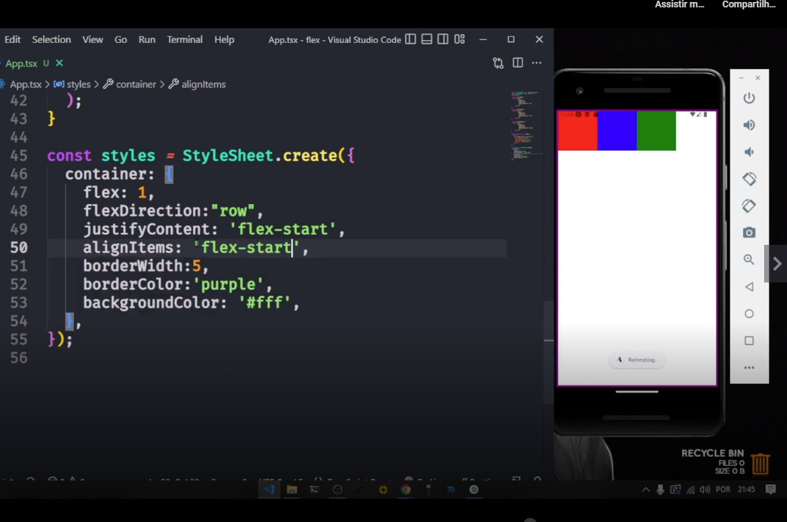
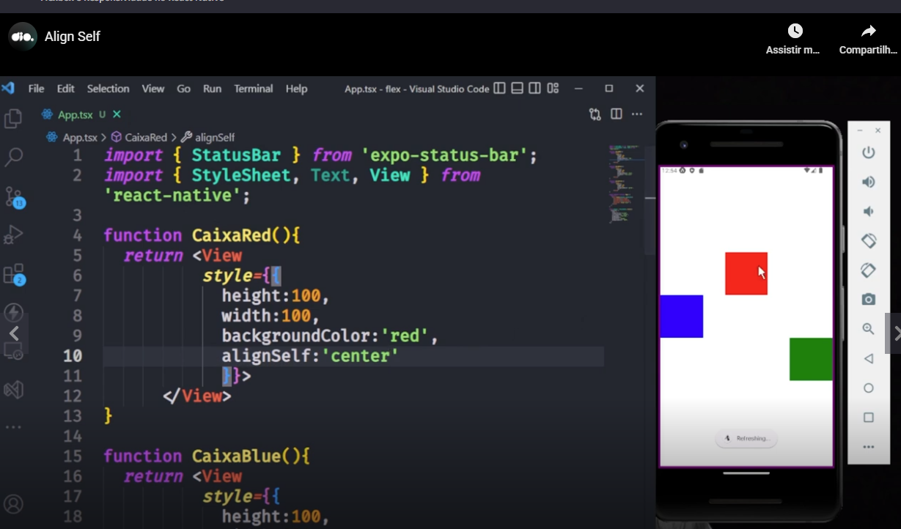

# Introduction

Teacher said that in web we have organization in flexbox model and organization in grid layout model (as used by Bootstrap).

Teacher also said that flexfox is default and you have no aditional declarations in your code to use flexbox.


# Container and children

Teacher said that we have to keep in mind that we have a container element (father) and a children element (son).

Is simple to understand, see this code:

```
<View>
    <Text></Text>
    <View>
        <Text></Text>
        <Text></Text>
    </View>
</View>
```

The outer <View /> component has 2 childrens, a <Text /> and another <View>. The inner <View> has 2 <Text /> components as children and is children of the outer <View />. And you can apply the same idea for the other components.


# Simple example with two boxes

Please see this simple example. In this example teacher draw 2 boxes in the screen, one red and another blue. These boxes were aligned vertically.

See that the boxes was drawn with <View /> components. Please remember the basic structure. We have to define a function first (one of each box). Part of the code of this example, defining one ot the two functions:


After, you have to use the component created with the function:


And as in this example we use <View /> inside of the function, please remember to import the <View /> component.

```
import {View} from 'react-native';   
```

Result in emulator:


# Flex

As you know and you could see in the previous example, you need to encapsulate the inner boxes in an outer box. You need to have only a father component in the application.

And if you remove "flex: 1" from the style configuration of the container?


Note: as you could see, the external container have a purple border **in this test**.

And you can also insert "flex: 1" in one of the boxes:


Explanation: the red box will get all vertical area not occupied by the blue box.

The same concept is valid if you increase the height of the blue box:


And if you add "flex: 1" to the style configuration of the blue blox?


And to blue box as example fill all the horizontal area, please change the width configuration in style confuguration, see:


As you could see, when teacher did not specify the unit (like "%") it was similar to pixels (px).

And if you have 4 boxes aligned vertically, each will use 25% of the area:


And if you have 2 boxes with height of 100 and 1 blue box with flex: 1 configuration:


# FlexDirection

The default value of this style configuration is column, but you canchange to "row":


A comment: "column" is the defalt value to React Native, but for web the default value is "row".

The result of do not set this configuration or set the value to "column" is exactly you expect:


You also have other values to the configuration flexDirection, as the weird "column-reverse", see:


A comment: this thing is a little confusing, but pay attention: **the configuration name uses camel case to separe the words ("flexDirection"), but in the value of the configuration the words are separeted by a dash ("column-reverse")**.

You also have the weird value "row-reverse".

Please remember: flexDirection needs to be applied to the **container**, not to the internal items (like "caixaGreen", "caixaRed" or "caixaBlue").


# Justify content

The alignment done by **justifyContent** stylization property is linked to the direction selected with the **flexDirection** stylization property.

Aligning content in a row:


Aligning content in a column:


## justifyContent: flex-start

Please pay attention that the name of the configuration property separes words in camel case and the value separes words by dashes.


### justifyContent: flex-start and flexDirection: column


### justifyContent: flex-start and flexDirection: row


### Other configurations with a little obviuos behaviour

- justifyContent: 'flex-end';
- flexDirection: 'row-reverse';
- flexDirection: 'column-reverse';


## justifyContent: 'space-around'

You will have a equal space between every element.


## justifyContent: 'space-between'

In this case you will have no space between an element and the right and left part of the app, only between the elements.


## justifyContent: 'space-evenly'

Sincerilly in this case I did not understand very well.


# final comments RELATED TO justifyContent

As final comments of the teacher, he said:

- That with flexbox you can have responsivity in your app without making calcs related to area, pixels etc;
- He showed us [this site](https://flexboxfroggy.com/) to make calculations related to flexbox;
- Teacher also commented that you have to keep in mind that stylezation in web (CSS) separes words with dashes and in React Native world camel case is used;
- And that in web the default related to direction is row and in React Native is column;
- And that we can have containers and childs.


# alignItems / justifyContent

Teacher said that while the 'justifyContent' configuration is linked to the main axis. And he showed this image:


And in the explanation he talked that when we are talking about the main axis, we are talking both of the properties **justifyContent** and **flexDirection**.

Teacher explained that if the main axis is the "X" axis (flexDirection: row), the secondary axis is the "Y" axis. And in this next image you can see that the image is centered in "X" and aligned using "flex-start" in "Y":


If you change the value of the porperty **flexDirection** to column, you invert the relation: the main axis will be the "Y" axis and the secondary axis will be the "X" axis. Please see this image


Is not too hard to understand. See this other example:


Other example:


Other example:



Other example:


Teacher remembered us that we need to add these style configurations in the **father** container.


# alignSelf

You can use **alignSelf** to apply a formatting configuration to the item itself (**child**), **not** to the container.

And **alignSelf** acts on the secondary axis.

See an example:


Talking about the next examples, think calmly. It is easy:

**Main axis** and **container**:

- flexDirection: column;
- justifyContent: center (center in Y axis, not in X axis)

**Secondary axis** and **child**:

- alignItems: flex-end;
- alignSelf: center (**red box**);
- alignSelf: flex-start (**blue box**).

In other words:

- To the container of all items are applied "flexDirection" and "justifyContent";
- To all childs is applied "alignItems";
- But the red box have a specific alignment configuration through "alignSelf";
- Same to to the blue box;
- The green box does noe have a particular alignment configuration.





# flexWrap

With **flexWrap** you can wrap a content if necessary. See, without:


As you could see the content was inserted in the end of the line and you could see only a part of the last box.

But if you insert **flexWrap: 'wrap'** (the default value is **nowrap**) in the styling configuration, the box will appear in the next line (row).


Teacher said that we can use a **<ScrollView />** if we need the component in the same line or column if we use **FlexWrap**.


# alignContent

- Please do not think that is the same of **AlignItems**;
- Use it wth **FlexWrap**;
- Use it in th father container;
- It determines how the elements will be positioned in the secondary axis;

In this example the elements will be centered in the Y axis:


if you remove **flexWrap** from the styling configuration, **alignContent** will have no effect:


Another example - with **flex-start** value:


Another example - with **flex-end** value:


# flexBasis

Change the length of a element based on the **flexDirection**.

Note:

- **flexBasis** is applied to the element;
- **flexDirection** (**important** to **flexBasis**) is applied to the container.

With **flexDirection** equals to "**row**" in the container:


With **flexDirection** equals to "**row**" in the container:


*OBS:** In the first example the value of **flexBasis** is 150 and in the second example the value is 50.


# Repository related to the classes

[link](https://github.com/digitalinnovationone/trilha-react-native-flexbox)


# Flexbox documentation related to React Native

[link](https://reactnative.dev/docs/flexbox)